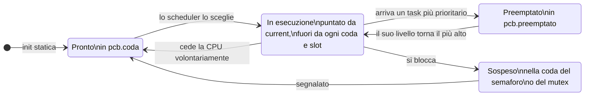
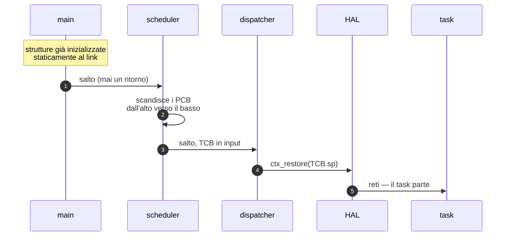
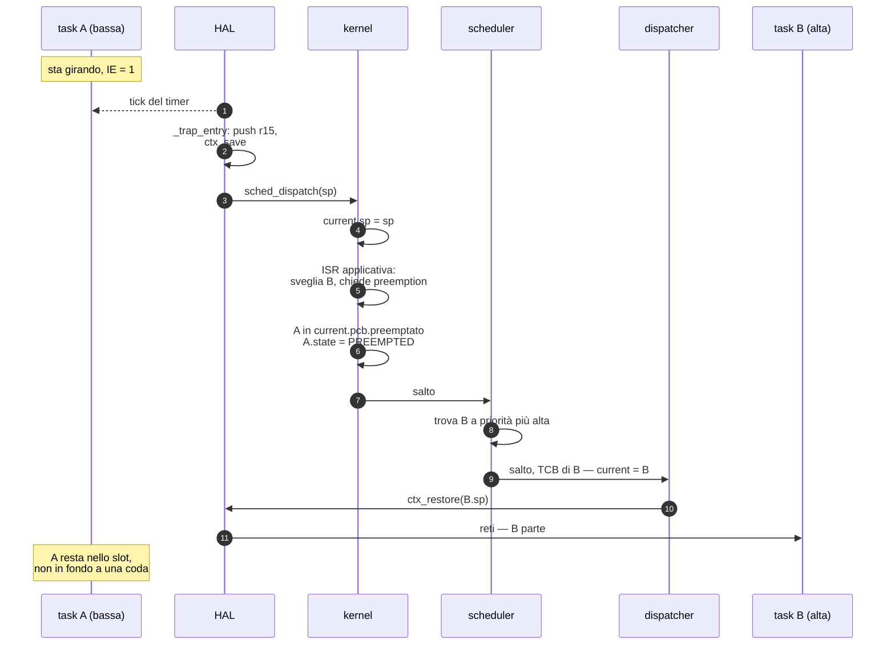
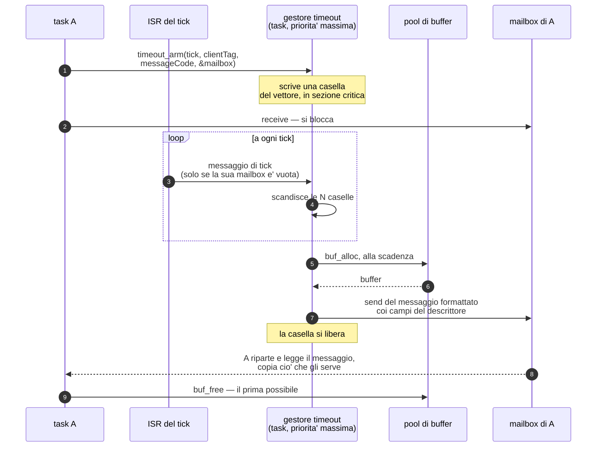

# Proposta: kernel realtime a priorità statiche con PCB

> Discussione del **29 agosto 2026**, proseguita il **30 agosto** in tre
> sessioni successive e il **5 settembre** (§12).
> Sostituirà il disegno a coda singola di
> [`linked/scheduler/kernel/scheduler.vasm`](../linked/scheduler/kernel/scheduler.vasm).
>
> **§12 è la sezione da leggere per prima se si riprende da qui**: rivede il
> confine HAL/ISR/kernel (l'HAL non nomina più il kernel), dà al dispatcher il
> TCB in input, definisce i tre modi di ritornare da un'ISR e aggiunge due
> istruzioni all'ISA. Rende superata la parte sull'orchestrazione dell'IRQ di
> §3.5 di [`stato-lavori.md`](stato-lavori.md). Nulla di §12 è implementato.
>
> **Stato: quattro decisioni prese (§7.1–7.3, §7.5), una aperta (§7.4).**
> Lo scheduler è ancora tutto da scrivere e non si scrive prima di §7.4. La
> **mailbox** invece è stata progettata e implementata (§8):
> [`kernel/messageHandling.vasm`](../linked/scheduler/kernel/messageHandling.vasm)
> esiste, gira ed è testato. Il **gestore dei timeout** è progettato ma non
> scritto (§9): modello a vettore di descrittori con interfaccia procedurale e
> pool di buffer, che sostituisce quello a messaggio prestato dal cliente — §9.6
> racconta perché è caduto.

I diagrammi sono in Mermaid: GitHub li rende nativamente; in VS Code serve
un'estensione per l'anteprima (*Markdown Preview Mermaid Support*).
****
---

## 1. Il modello

- **TCB, code di priorità, PCB, mailbox e semafori sono dichiarati e
  inizializzati staticamente.** Nessuna allocazione, nessun percorso d'errore
  all'avvio, footprint noto al link.
  - **TCB**: il primo contesto di ogni task ha i registri a 0 e gli interrupt
    abilitati.
  - **PCB** (*Priority Control Block*): uno per ogni coda di priorità, con due
    campi — l'indirizzo della coda di quel livello e l'indirizzo dell'eventuale
    TCB preemptato a quel livello.
  - **Mailbox**: *è* una testa di coda di `coda.vasm`, con il contatore usato
    con segno (§8). Una per task, ed è l'**unico punto di blocco di un task**
    (§7.5).
  - **Semafori**: da specificare.
  - **Messaggi**: per il kernel sono solo nodi di lista — due link e un
    payload che non legge mai (§8). Il buffer è di chi manda: nel traffico
    richiesta/risposta è memoria del cliente prestata al fornitore per la durata
    della richiesta (§8.6). Dove un cliente che possa prestarla non c'è — il
    gestore dei timeout, che compone il messaggio alla scadenza — si passa da un
    **pool** di buffer a taglia fissa, che è a sua volta una `TESTA` con i buffer
    come nodi (§9).
- **Esiste sempre un task idle**, a priorità minima, che non rilascia mai la
  CPU: viene solo preemptato.
- **Il main salta allo scheduler**, che seleziona il TCB del primo task pronto
  scandendo le priorità.
- **Lo scheduler salta al dispatcher** passandogli in input il TCB da attivare.

### Nota terminologica

Nel seguito **«slot»** è l'abbreviazione per *il campo `preemptato` del PCB*,
cioè il secondo campo dell'elenco qui sopra. Non è un concetto aggiuntivo.

---

## 2. Perché il campo `preemptato` porta il peso di tutto il modello

Con una ready queue sola, un task preemptato torna in fondo alla coda: sta
pagando per un'interruzione che non ha chiesto. Quando il livello riprende la
CPU parte un **altro** task, e quello interrotto ha perso il turno senza aver
fatto nulla.

Lo slot lo tiene da parte, identificato, e glielo restituisce: la preemption
diventa trasparente al preemptato. In più separa tre situazioni che nel disegno
attuale finiscono nello stesso posto:

| Il task… | …finisce | perché |
|---|---|---|
| ha lasciato la CPU **controvoglia** | in `PCB.preemptato` | riprenderà da dove stava |
| **l'ha ceduta lui** | in fondo a `PCB.coda` | ha rinunciato al turno |
| si è **bloccato** | nella coda del semaforo o del mutex | non è più eseguibile |

### Cosa cambia rispetto a oggi

| Disegno attuale | Modello a PCB |
|---|---|
| Una ready queue sola, nessuna priorità | Una coda per livello, scandite dall'alto |
| `scheduler` riaccoda **sempre** l'uscente: il blocking è inesprimibile | Dove va l'uscente lo decide chi lo toglie dalla CPU, non chi sceglie il prossimo |
| La coda non è mai vuota solo perché si accoda prima di estrarre | L'idle a priorità minima garantisce la terminazione della scansione |
| `dispatcher` rilegge `current` dalla memoria | Il TCB arriva al dispatcher come argomento |
| Il primo task parte da un percorso di boot dedicato | Il primo task parte come il millesimo switch |

---

## 3. Le strutture statiche

Le code sono quelle già implementate in
[`kernel/coda.vasm`](../linked/scheduler/kernel/coda.vasm): liste circolari
doppie con sentinella, idioma `list_head` del kernel Linux.

```mermaid
classDiagram
    direction LR

    class TESTA {
        +fwd : void*
        +bwd : void*
        +count : word
        coda_init()
        enqueue_coda()
        dequeue_testa()
        remove_buffer()
    }

    class TCB {
        +fwd : void*
        +bwd : void*
        +sp : void*
        +pcb : PCB*
        +state : word
    }

    class PCB {
        +coda : TESTA*
        +preemptato : TCB*
    }

    class SEMAFORO {
        +coda : TESTA
        +conteggio : word
    }

    class MUTEX {
        +coda : TESTA
        +owner : TCB*
        da definire in §7.4
    }

    class MAILBOX {
        E' una TESTA
        +count con segno
    }

    class MESSAGGIO {
        +fwd : void*
        +bwd : void*
        +payload : bytes
    }

    class PAYLOAD {
        +pool : word
        +messageType : word
        +clientTag : word
        +messageCode : word
        +replyMailbox : MAILBOX*
        +specifiche : bytes
    }

    class TIMEOUT {
        task a priorita' massima
        +descrittori : N x DESCRITTORE
        timeout_arm()
        timeout_cancel()
    }

    class DESCRITTORE {
        +scadenza : word
        +clientTag : word
        +messageCode : word
        +replyMailbox : MAILBOX*
    }

    class POOL {
        E' una TESTA
        buf_alloc()
        buf_free()
    }

    TCB ..|> TESTA : condivide fwd/bwd
    TCB --> PCB : livello di appartenenza
    PCB --> TESTA : coda del livello
    PCB ..> TCB : slot preemptato
    MAILBOX ..|> TESTA : e' una testa, con count con segno
    SEMAFORO ..> TCB : coda di attesa
    MUTEX ..> TCB : coda di attesa + owner
    MESSAGGIO ..|> TESTA : condivide fwd/bwd
    PAYLOAD ..> MESSAGGIO : si sovrappone a payload
    TIMEOUT *-- DESCRITTORE : vettore statico, mai in lista
    TIMEOUT ..> POOL : preleva un buffer alla scadenza
    TIMEOUT ..> MAILBOX : send del messaggio formattato
    POOL ..|> TESTA : e' una testa; i buffer sono i nodi
    MAILBOX o-- MESSAGGIO : gia' consegnati
    MAILBOX o-- TCB : ricevente in attesa (count < 0)
```

> `PAYLOAD` è tratteggiato di proposito: **non è del kernel**. È la convenzione
> fra clienti e fornitori di servizi, e `messageHandling.vasm` non ne legge un
> byte (§8).

> Il TCB non **eredita** da TESTA: ne condivide i primi otto byte, così lo
> stesso codice di insert/remove vale per la testa e per i nodi.

### Layout dei campi

**TCB** — 20 byte

| Off | Campo | Significato |
|---|---|---|
| +0 | `fwd` | link avanti |
| +4 | `bwd` | link indietro |
| +8 | `sp` | contesto opaco salvato |
| +12 | `pcb` | **indirizzo del PCB** del suo livello (§7.3) |
| +16 | `state` | stato corrente, quattro valori (§7.2) |

> **Una coppia di link sola** (§7.5): il TCB può stare in una lista alla volta,
> e le posizioni previste sono mutuamente esclusive — coda di ready, coda
> d'attesa, oppure `PCB.preemptato`, che è un puntatore e non una lista. Nessun
> secondo link per le attese a tempo: un timeout armato non mette in lista
> **niente** — è una casella nel vettore del gestore (§9.3).

**PCB** — 8 byte, uno per livello di priorità

| Off | Campo | Significato |
|---|---|---|
| +0 | `coda` | indirizzo della coda di questo livello |
| +4 | `preemptato` | TCB interrotto a questo livello, 0 se nessuno |

**TESTA** — 12 byte (già esistente, invariata)

| Off | Campo | Significato |
|---|---|---|
| +0 | `fwd` | primo nodo, o sé stessa se vuota |
| +4 | `bwd` | ultimo nodo |
| +8 | `count` | elementi in coda |

**MAILBOX** — *è* una `TESTA`, 12 byte, nessun campo in più

Non serve un campo `owner`: il TCB in attesa sta **dentro** la lista, quindi la
`send` se lo trova sfilandolo. Cambia solo la convenzione del contatore (§8).

**MESSAGGIO** — due link e un payload

| Off | Campo | Significato |
|---|---|---|
| +0 | `fwd` | link (idioma `list_head`, come `TESTA` e `TCB`) |
| +4 | `bwd` | |
| +8.. | `payload` | `payload[0]`: il kernel non lo legge e non lo scrive **mai** |

`payload` è un **indirizzo, non un campo**: la lunghezza la decide chi compone il
messaggio. Ne segue che `MESSAGGIO.size` non è la dimensione di un messaggio e
`.res MESSAGGIO` non va usata.

**PAYLOAD** — testa comune del payload, 20 byte (il primo è `pool`, la
provenienza del buffer — §10.2), poi le specifiche

Convenzione fra clienti e fornitori, **non** del kernel.

| Off | Campo | Significato |
|---|---|---|
| +0 | `messageType` | `MSG_REQUEST` / `MSG_REPLY`: la direzione |
| +4 | `clientTag` | parola **opaca** scelta dal cliente, che il fornitore ricopia identica nella risposta senza leggerla |
| +8 | `messageCode` | codice della richiesta; nella risposta è un codice di **esito**, di uno spazio diverso |
| +12 | `replyMailbox` | mailbox del cliente = la sua identità (una per task) |
| +16.. | `specifiche` | `specifiche[0]`: le pubblica il fornitore nel proprio `.vinc` |

Perché serve `messageType` avendo già `clientTag`: anche una richiesta **in
arrivo** porta un `clientTag`, scelto però nello spazio di chi l'ha mandata, e
chi riceve non ha modo di distinguere «è uno dei miei» da «è di un altro». Con la
direzione esplicita, lo spazio dei codici di una mailbox si divide in due per
costruzione. Tenerlo come parola separata invece che come bit dentro
`messageCode` è anche più economico su questa macchina: non c'è `andi`, quindi
mascherare costerebbe materializzare la maschera in un registro.

> **Invariante: una risposta si smista su `clientTag`, MAI sul codice.** Smistare
> sul codice funziona con un fornitore solo e si rompe al secondo, perché i
> codici di esito li sceglie ogni fornitore nel proprio spazio.

### Variabili globali del kernel

| Nome | Significato |
|---|---|
| `current` | indirizzo del TCB in esecuzione (già esistente, sopravvive — §7.1) |

> **Un'indirezione in meno.** Se ogni PCB ha esattamente una coda e sono
> entrambi statici, la `TESTA` può stare **dentro** il PCB invece di essere
> puntata: si risparmia una `lw` per ogni livello scandito, e la scansione è il
> percorso più caldo del kernel. Il puntatore serve solo se un giorno più PCB
> devono condividere la stessa coda. *Da valutare.*

---

## 4. La regola di selezione

Lo scheduler scandisce i livelli dal più alto al più basso. A ogni livello **lo
slot batte la coda**: se c'è un task interrotto qui, tocca a lui riprendere, non
a un suo pari che stava solo aspettando.


**La scansione termina sempre**: l'idle non si blocca mai, quindi il livello
minimo è pronto per costruzione. Non serve il caso "nessun task eseguibile".

**Perché un solo campo `preemptato` basta.** A ogni livello, al massimo un task
può trovarsi a metà esecuzione. Un secondo task dello stesso livello potrebbe
partire solo se il livello venisse selezionato, e la selezione preferisce lo
slot alla coda: finché lo slot è pieno, dalla coda non esce nessuno. È **questa
preferenza** a rendere corretto un campo singolo — invertirla richiederebbe una
pila.

---

## 5. Lo stato di un task e la sua posizione

Lo stato di un task corrisponde a una posizione fisica precisa. Il campo
`state` **non è ridondante** (§7.2): serve per sapere in quale coda un TCB si
trova *adesso*, cosa che il solo `TCB.pcb` non dice.



**Ci possono essere più task `PREEMPTED` contemporaneamente**: A a priorità 5
preemptato da B a 3, preemptato a sua volta da C a 1 — due slot occupati, un
solo `current`. Ne discende un regalo per il debug: **la catena degli slot
occupati, letta dall'alto verso il basso, è la pila delle preemption
annidate**, e la si ottiene scandendo la tabella dei PCB senza tenere traccia di
nulla.

---

## 6. I due percorsi

Il primo avvio e ogni cambio di contesto successivo passano dallo **stesso
codice**: il boot non è un caso particolare, è semplicemente la prima volta che
lo scheduler scandisce i livelli.

### Avvio



Nessuna `call`: sono salti, e nessuno di questi passi ha un ritorno da onorare.
Sparisce la finzione attuale delle tre `call` che non ritornano mai
(`sched_dispatch` → `dispatcher` → `ctx_restore`, più `call sched_dispatch` in
[`hal/machine.vasm:53`](../linked/scheduler/hal/machine.vasm#L53)).

### Preemption



A non perde il turno: quando il suo livello torna il più alto, riprende
esattamente da dove era.

---

## 7. Le decisioni

### 7.1 `current` sopravvive — **DECISA**

Esiste già la variabile che contiene l'indirizzo del TCB in esecuzione, e resta.

Conseguenza sulla semantica dello slot: **si riempie nell'istante della
preemption**, non mentre il task gira. Il task in esecuzione resta com'è oggi —
fuori da ogni coda e da ogni slot, puntato solo da `current`. Il percorso di
trap non cambia struttura: l'HAL consegna l'`sp`, il kernel lo scrive in
`current.sp`.

### 7.2 `state` resta, ma i valori diventano quattro — **DECISA**

Il campo è essenziale per il debugging. **E ha un secondo motivo tecnico**: dato
un TCB, `TCB.pcb->coda` fornisce la sua coda di *ready*, non la coda in cui si
trova **adesso**. Se il task è sospeso sta in quella di un semaforo o di un
mutex, e per sganciarlo con `remove_buffer` (che vuole la testa giusta, vedi
[`coda.vasm:87-95`](../linked/scheduler/kernel/coda.vasm#L87-L95)) bisogna sapere
quale delle due. Senza `state` non lo sai. Non è ridondanza: è l'unico modo di
sapere dove cercare.

Oggi [`types.vinc`](../linked/scheduler/include/types.vinc) ha tre valori. Con lo
slot ne serve un quarto: un task in `PCB.preemptato` non è in una coda di ready,
non è sulla CPU e non è bloccato. Marcarlo `READY` farebbe mentire il campo
proprio nel momento in cui lo si interroga per capire cosa sta succedendo.

```
.equ READY      0    ; in pcb.coda
.equ RUNNING    1    ; puntato da current, fuori da tutto
.equ PREEMPTED  2    ; in pcb.preemptato          <- NUOVO
.equ SUSPENDED  3    ; in una coda di semaforo o mutex
```

### 7.3 `TCB.pcb` contiene l'indirizzo del PCB, non il numero di livello — **DECISA**

Il guadagno è sul percorso di riaccodamento, che è caldo (preemption, yield,
risveglio da semaforo): con un indice servirebbe `slli` + `add` sulla base della
tabella e poi la `lw` per arrivare alla coda; col puntatore è una `lw` sola. È lo
stesso idioma della lista intrusiva — si memorizza il puntatore che si
dereferenzierà, non un indice da convertire.

> ### ⚠ Invariante portante: la tabella dei PCB va disposta in ordine di priorità
>
> Le decisioni di scheduling non usano la priorità solo per raggiungere una
> coda: la **confrontano**. Quando un semaforo viene segnalato da un'ISR bisogna
> sapere se il task risvegliato è più prioritario di quello in esecuzione, per
> decidere se chiedere la preemption.
>
> Con un puntatore il confronto non è possibile — **a meno che la tabella dei
> PCB non sia disposta in memoria in ordine di priorità**. Se lo è, l'indirizzo
> è monotòno nella priorità e una `blt` sui puntatori *è* il confronto, senza
> conversioni.
>
> Essendo tutto statico quella disposizione ci sarà comunque, ma va scritta come
> invariante esplicita: lega la correttezza dei confronti all'**ordine di
> dichiarazione** nella sezione dati. Chi un domani inserisce un livello in mezzo
> o riordina le direttive rompe i confronti **senza che nulla segnali l'errore**.
> È il tipo di difetto che si manifesta come inversione di priorità sporadica sei
> mesi dopo.

Effetto collaterale gradito: se si adotta l'ereditarietà, cambiare priorità a un
task diventa **ripuntarlo a un altro PCB**. La priorità nominale sarebbe un
secondo campo dello stesso tipo — due puntatori simmetrici, nessuna aritmetica.

Il nome `prio` sarebbe fuorviante per un campo che contiene un indirizzo: si
chiama `pcb`.

### 7.4 Inversione di priorità: ereditarietà o ceiling? — **APERTA, da decidere**

**È la questione da riprendere.** Priorità statiche più mutex, senza
contromisure, danno inversione illimitata: un task ad alta priorità resta dietro
a uno basso per un tempo non calcolabile.

Il campo `prio_eff` riguarda i **mutex, non i semafori**. L'ereditarietà ha senso
solo dove c'è un *proprietario* da promuovere: un semaforo contatore non ce l'ha
— chi si blocca aspetta un evento, non un task, e non c'è nessuno da spingere in
alto. Ne segue che **mutex e semaforo non sono lo stesso tipo con parametri
diversi**: il mutex ha in più il TCB del possessore, ed è quel campo a rendere
possibile l'ereditarietà. Molti kernel piccoli li fondono e poi se ne pentono.

Il punto delicato non è promuovere, è **tornare indietro**. Se un task possiede
due mutex ed è stato promosso da due bloccati diversi, al rilascio del primo non
deve tornare alla priorità nominale: deve restare alto per l'altro. Il ripristino
ingenuo "rilascio → torno nominale" è corretto solo con un mutex alla volta.

Le due strade cambiano **cosa va dichiarato staticamente**:

| | Ereditarietà vera | Priority ceiling (ICPP) |
|---|---|---|
| **Come funziona** | al rilascio si ricalcola la priorità effettiva come massimo fra la nominale e il bloccato più prioritario di ogni mutex ancora posseduto | ogni mutex ha un *ceiling* statico; chi lo acquisisce viene promosso subito a quel livello, indipendentemente da chi si bloccherà poi |
| **Costo nel TCB** | una `TESTA` per la lista dei mutex posseduti: +12 byte, più il link nel mutex | nulla |
| **Costo nel mutex** | link di lista | un campo con la priorità precedente all'acquisizione |
| **Costo a runtime** | ricalcolo a ogni rilascio | O(1) |
| **Rischio** | complessità | il ceiling va dichiarato correttamente a mano: se un task più prioritario del ceiling prende il mutex, la garanzia salta **in silenzio** |

**Raccomandazione: il ceiling.** Discende da come è impostato tutto il resto — se
task, mutex e priorità sono dichiarati staticamente, si sa già quali task possono
toccare quale mutex, quindi **il ceiling è una costante calcolabile a
compile-time**, non una cosa da scoprire a runtime. È esattamente il tipo di
analisi che l'allocazione statica regala. In più il ceiling dà un limite
superiore calcolabile al blocking time, che è ciò che serve se il sistema deve
essere analizzabile davvero.

Con acquisizioni e rilasci **annidati per costruzione**, salvare nel mutex la
priorità precedente basta: non serve nessuna lista.

### 7.5 Il TCB ha una sola coppia di link — **DECISA**

Il TCB ha `fwd`/`bwd` a offset 0 e nient'altro: può stare in **una** lista alla
volta. Oggi regge, perché le posizioni previste dal modello sono mutuamente
esclusive — coda di ready, coda d'attesa di un semaforo o di un mutex, oppure lo
slot `PCB.preemptato`, che è un puntatore e non una lista (ed è un pregio dello
slot, non un dettaglio).

Si romperebbe con le **attese a tempo**: una `receive` con timeout mette il task
nella coda dell'evento *e* in una lista di scadenze contemporaneamente. Due
liste, un TCB, una coppia di link. È esattamente il motivo per cui il TCB di
FreeRTOS ha due `ListItem_t` (`xStateListItem` e `xEventListItem`) invece di uno.

**Il TCB resta con una coppia sola**, perché il modello di timeout scelto (§9)
non tratta il timeout come uno *stato del task*: un timeout armato è una casella
di un vettore statico del gestore, e fino alla scadenza non c'è niente in nessuna
lista — né il TCB né altro (§9.3). Il task aspetta in un posto solo, la propria
mailbox. Non c'è niente da mettere in due liste, quindi non serve una seconda
coppia. Il layout a due `ListItem_t` è la risposta giusta
per un kernel con molte primitive di blocco; non lo è per uno in cui il blocco è
centralizzato in un punto.

Ne discendono tre conseguenze, tutte da tenere in conto:

1. **`coda.vasm` resta intatta**, e con lei il suo contratto forte — «il link sta
   a offset 0, quindi il puntatore al link *è* il puntatore al buffer, niente
   `container_of`» ([`coda.vasm:5-6`](../linked/scheduler/kernel/coda.vasm#L5-L6)).
   Con una seconda coppia a offset non nullo quel contratto sarebbe rimasto vero
   per le primitive e falso per i chiamanti, costretti a risalire al TCB con un
   `addi` dopo ogni `dequeue_testa` sulla lista d'evento: una istruzione, gratis
   a runtime, ma una regola in più da rispettare a ogni singolo uso — e
   dimenticarla produce un puntatore che **sembra** un TCB valido.
2. **La mailbox è l'unico punto di blocco di un task.** Il meccanismo funziona
   perché il task aspetta in un posto solo: se si bloccasse altrove, il messaggio
   di timeout arriverebbe in una mailbox su cui non sta aspettando e non lo
   sveglierebbe nessuno. È il modello dei kernel a messaggi (OSE, i *pulse* di
   QNX) ed è la scelta di fondo che questa decisione porta con sé.
3. **`sem_wait` non ha timeout, per costruzione.** Chi vuole un tempo massimo
   passa dalla mailbox. Se un domani si lasciano ai task anche semafori bloccanti
   diretti, coesistono due discipline e la garanzia «posso sempre mettere un
   tempo massimo» salta **in silenzio** proprio dove si usa il semaforo nudo.

> **Da rivedere in §7.2.** Se `SUSPENDED` implica «nella coda della propria
> mailbox», il secondo argomento tecnico di §7.2 — serve `state` per sapere da
> quale testa sganciare un TCB con `remove_buffer` — perde forza: la testa si
> conosce per costruzione. `state` resta comunque, per il debug e per distinguere
> `READY` / `RUNNING` / `PREEMPTED`, che code non sono.

---

## 8. La mailbox — **IMPLEMENTATA** il 30/08/2026

§7.5 ha promosso la mailbox a *unico punto di blocco di un task*, ma la sezione
che la descriveva era rimasta quella di prima: quindici righe sul vincolo di
layout imposto da `coda.vasm`. Qui c'è il ragionamento intero, e il codice che ne
è uscito ([`kernel/messageHandling.vasm`](../linked/scheduler/kernel/messageHandling.vasm)).

### 8.1 Una per task

È la decisione che governa tutte le altre. Se più task potessero fare `receive`
sulla stessa mailbox, il risveglio dovrebbe andare al **più prioritario** fra gli
attesa, e `coda.vasm` conosce solo FIFO e LIFO: servirebbe l'inserimento ordinato
per priorità, cioè proprio la primitiva che §7.4 si compiace di non dover
scrivere sotto ICPP. Svegliare in ordine d'arrivo in un kernel a priorità
statiche è un'inversione che non si vede né nei test né nel codice.

Si perde il pattern *un porto di richieste, N worker*: con task statici lo si
sostituisce con un dispatcher esplicito.

### 8.2 Il contatore con segno, **descrittivo**

Una lista sola per due popolazioni, e il **segno del contatore dice quale**:

```
count > 0   in lista ci sono count MESSAGGI, nessuno in attesa
count < 0   in lista ci sono -count TCB in attesa, nessun messaggio  (qui: -1)
count == 0  lista vuota
```

Regge perché le due popolazioni sono **mutuamente esclusive per costruzione**: un
ricevente si accoda solo se non ci sono messaggi, un messaggio si accoda solo se
non c'è un ricevente. Il segno va interrogato **prima** di toccare la lista:
accodare un messaggio con un TCB dentro porterebbe il contatore a 0 con due nodi
di tipo diverso in lista, e da lì non si torna indietro.

Non è il contatore **contabile** di un semaforo (*disponibili meno in attesa*).
Quello lascerebbe una finestra in cui il conto è pari mentre in lista c'è un
messaggio, e obbligherebbe la `receive` a un ramo asimmetrico «al risveglio non
pagare perché avevi già pagato». Il contatore descrittivo dice la verità sulla
lista in ogni istante e i due percorsi della `receive` diventano lo stesso.

Complemento a due e non modulo-e-segno, per tre ragioni verificate sulla
macchina: `lw` **estende il segno** da 32 a 64 bit ([`vcpu.c:180`](../src/vcpu.c#L180),
registri `int64_t`), quindi un bit di tipo a bit 31 il segno lo produce già da
sé; non c'è `andi`, quindi mascherare vorrebbe `li` più `and`; e il vuoto
avrebbe due codifiche. Col complemento a due la vacuità resta `beq count, r0` e
il tipo è `blt count, r0`, senza maschere.

> L'argomento che decide non è il conteggio di istruzioni: se la `pop` mascherasse
> un bit di tipo, **`coda.vasm` imparerebbe la codifica della mailbox** — e quel
> modulo serve anche alle code di ready, ai mutex e alla free-list del pool. Col
> complemento a due `dequeue_testa` resta il codice di sempre e la convenzione
> vive tutta in `messageHandling.vasm`.

### 8.3 Cosa cambia in `coda.vasm`: lo strato `_nc`

La contabilità è del chiamante, quindi servono primitive che manipolino i link
**senza toccare il contatore**: `enqueue_coda_nc`, `enqueue_testa_nc`,
`dequeue_testa_nc`, `remove_buffer_nc` (quest'ultima la vuole `timeout_cancel`).

Non sono routine *aggiunte*: sono il **corpo** di quelle contate, che ora
aggiornano il contatore e **cadono in sequenza** dentro di esse. Nessuna `call`
(restano foglia), nessuna riga di splicing scritta due volte, e i chiamanti
esistenti non cambiano. La contata interroga il contatore per la vacuità, com'è
sempre stato; la `_nc` interroga la struttura (`fwd == &testa`), perché è la
primitiva che per definizione il contatore lo ignora.

Secondo asse di nomi, **ortogonale** a `_s`: `_s` è *protetta*, `_nc` è *non
contata*. I due assi non si moltiplicano — le `_nc` non avranno mai una variante
`_s`, perché la sezione critica deve comprendere anche l'aritmetica del contatore
e quindi appartiene per forza al chiamante.

> **Regola: una sola disciplina per testa.** Una testa gestita con le contate ha
> `count >= 0` = numero di nodi; una gestita con le `_nc` ha la convenzione del
> suo proprietario. Mescolarle fa derivare il contatore in silenzio.

`coda.vasm` ha poi guadagnato l'**invariante dei link** e un esito di ritorno,
per una ragione che è nata discutendo il pool: vedi §10.2.

### 8.4 Il messaggio è opaco

Per il kernel un messaggio è **solo un nodo di lista**: `fwd`, `bwd`, e da +8 un
payload che non legge né scrive mai (§3). Comporlo correttamente è di chi lo
manda, interpretarlo di chi lo riceve.

La prima stesura aveva un header di kernel da 20 byte con `scadenza`, `mailbox` e
`dove`: dava al kernel la proprietà di dodici byte di ogni messaggio e infilava
nel tipo generico i campi di **un solo** suo cliente, il gestore dei timeout.
Quei campi vanno nel payload del servizio che li usa. Prova oggettiva che il
confine è al posto giusto: `messageHandling.vasm` non referenzia **nessun** campo
di `MESSAGGIO`.

### 8.5 I due percorsi, e perché non serve un `owner`

`send(mailbox, messaggio)` guarda il segno. Se `count >= 0` non c'è nessuno in
attesa: accoda e incrementa. Se `count < 0` c'è un ricevente, ed è **dentro la
lista** — la `send` lo sfila, mette il messaggio al suo posto (`-1` → `+1`) e lo
rende eseguibile. È per questo che la mailbox non ha bisogno di un campo `owner`
e il TCB non cambia layout.

`receive(mailbox)` decrementa niente e non ricontrolla nulla: se `count > 0`
sfila un messaggio, se è 0 accoda **il proprio TCB**, scrive `-1` e cede la CPU.
Con un solo ricevente nessuno può rubargli il messaggio fra la sveglia e
l'esecuzione, quindi **non serve il ciclo di ricontrollo** che un semaforo
generico richiede: il percorso di ripresa è una linea retta. `count < 0`
all'ingresso è un secondo ricevente, cioè un errore di costruzione del sistema.

`send` è **raw** perché il mittente non è sempre un task: l'ISR del tick manda il
messaggio di tick alla mailbox del gestore dei timeout (§9.2), a interrupt già
disabilitati. `send_s` è la variante protetta, per i task. `receive` non ha né
può avere una `_s`:
la sezione critica deve comprendere il test del contatore, l'accodamento del
proprio TCB e il blocco — proteggere la sola lettura e lasciare fuori la
decisione sarebbe attivamente dannoso.

### 8.6 Il protocollo sopra la mailbox

Ogni **fornitore di servizi** pubblica la propria interfaccia in un `.vinc`: la
mailbox se è un task, gli indirizzi delle entry se è un'API, e in entrambi i casi
le `.struct` del payload — una per richiesta — più le `.size` con cui il cliente
dimensiona il buffer. `.struct` in questo assembler non alloca, produce offset:
la sovrapposizione a un indirizzo è letteralmente ciò che fa già.

Il guadagno è che **il codice che compone una richiesta è identico** nei due
casi: cambia solo come si recapita, una `send` o una `call`. Un servizio può
migrare da API a task senza che i clienti cambino.

Sopra il payload sta la testa comune di §3 (`PAYLOAD`), e la risposta è **lo
stesso buffer girato**: il fornitore capovolge `messageType`, scrive il codice di
esito, riempie le specifiche e lo rispedisce a `replyMailbox`, con `clientTag`
già al posto giusto. Nessuna allocazione, nessun pool che si esaurisca, nessuna
`send` che possa fallire — il buffer è memoria del cliente prestata al fornitore
per la durata della richiesta. Il cliente lo dimensiona sul **maggiore** fra
specifiche di richiesta e di risposta.

> La routine generica di risposta **legge il payload**, quindi non può stare in
> `messageHandling.vasm` senza rompere §8.4: il protocollo è uno strato **sopra**
> la mailbox e va in un modulo suo.

### 8.7 Cosa resta aperto

- **`task_ready` / `task_block`.** I due simboli che il kernel deve fornire sono
  `.extern` con il contratto scritto, ma `task_block` non può esistere finché non
  si decide come si entra nel kernel da un task: **non c'è trap software
  nell'ISA** (verificato: solo `sti`/`cli`/`reti`/`sethandler`/`settimer`), quindi
  serve una routine HAL che fabbrichi un frame di trap finto. Il che dice anche
  che `ctx_init` **non è eliminabile** come ipotizza §11: quella macchineria serve
  a regime, non solo al boot.
- **`receive` legge `current`** direttamente: il modulo dei messaggi conosce una
  variabile dello scheduler. Va dietro il hook.
- **L'`halt`** sul secondo ricevente: fermare la macchina è una politica, e non è
  della mailbox deciderla.
- **`send_s` promette più di quanto dia**: `.proc` salva solo r5, l'unico
  registro scritto nel corpo del wrapper, mentre la `send` sotto sporca r3 e r4.
- ~~**`.include` non è idempotente**~~ — **CHIUSO il 05/09/2026.** Era: includere
  due volte lo stesso `.vinc` è un errore secco (`duplicate constant`), e col
  modello «un `.vinc` per fornitore» i file si moltiplicano. Ora una seconda
  inclusione dello stesso file è un no-op, l'identità è il file sul disco e non
  la stringa scritta, e c'è `-I` per nominare un `.vinc` senza il suo path.
  Dettagli in §3.16 di [`docs/stato-lavori.md`](stato-lavori.md), uso in §4.2.2
  del manuale.

---

## 9. Timeout: un gestore a descrittori, con interfaccia procedurale

> **Riscritta il 30/08/2026.** Sostituisce il modello «il cliente presta il
> proprio messaggio», che è raccontato in §9.6 insieme al motivo per cui è
> caduto — è quella la parte che serve a non riproporlo.

Un timeout resta **una consegna in mailbox che avviene più tardi**: chi vuole un
tempo massimo chiede al gestore di recapitargli un messaggio a una certa
scadenza, poi si blocca sulla propria mailbox come si bloccherebbe comunque, e al
risveglio distingue l'evento vero dalla scadenza guardando cosa ha ricevuto.
Cambia **come** si chiede e **chi possiede il messaggio**.

### 9.1 La forma

L'interfaccia è **procedurale**: `timeout_arm` e `timeout_cancel` sono `call`,
non messaggi. Il cliente non fornisce un buffer — fornisce quattro parole:

| Parametro | A cosa serve |
|---|---|
| numero di tick | il ritardo, da cui il gestore calcola la scadenza assoluta |
| `clientTag` | correla la scadenza con l'attesa che l'ha armata (§9.4) |
| `messageCode` | il codice che il cliente vuole leggere quando scade |
| `replyMailbox` | dove consegnare: la mailbox del cliente, che è la sua identità |

Il gestore tiene un **vettore statico di descrittori**, non una lista. Quanti
timeout simultanei può avere un sistema come questo? Una decina. Un descrittore è
esattamente quelle quattro parole, con la scadenza al posto del ritardo, più un
campo **`stato`** che dice se la casella è libera o armata.

Lo stato è **esplicito e non dedotto** da `replyMailbox == 0`, come diceva la
prima stesura. È lo stesso argomento con cui §7.2 tiene `TCB.state` invece di
dedurre dov'è il task da `TCB.pcb`: uno stato scritto si legge in un dump e si
controlla, una convenzione no. In più toglie il vincolo implicito «nessuna
mailbox all'indirizzo 0», e fa sì che una `timeout_cancel` con identità
spazzatura non combaci con niente invece di combaciare con **tutti** gli slot
liberi. Due valori bastano: il caso «scaduto ma pool vuoto» di §9.2 non è un
terzo stato, perché lasciando la casella armata la scadenza è già passata e il
ritentativo al tick successivo è automatico. Con `TMO_FREE = 0` il vettore in
`.data` nasce azzerato, quindi nasce tutto libero e non serve nessuna
`timeout_init`.

Non c'è **nessun handle**: si cancella per **identità**, la coppia
`(replyMailbox, clientTag)` — vedi §9.5, dove la decisione è motivata.

Alla scadenza il gestore preleva un buffer dal **pool**, ci formatta un messaggio
con i tre campi del descrittore e lo manda a `replyMailbox`. Il task che lo
riceve **copia quello che gli serve e rilascia il buffer al pool il prima
possibile**: il buffer è una risorsa di sistema in prestito, non memoria sua.



### 9.2 Il gestore è un task ad altissima priorità, non l'ISR

La prima stesura faceva girare il gestore **dentro** l'ISR del tick, per non
pagare un cambio di contesto per tick. È il compromesso sbagliato: l'ISR fa una
cosa sola — manda un messaggio di tick alla mailbox del gestore — e tutto il
resto è un task a priorità massima.

Il guadagno non è il buffer, è che **la scansione O(N) esce dal tempo a interrupt
disabilitati**. Con il gestore nell'ISR la latenza di interrupt del sistema
dipende da quanti timeout sono armati; con il gestore come task no. In un kernel
realtime quell'argomento batte il costo del cambio di contesto.

Il secondo guadagno arriva gratis: **il pool vuoto smette di essere un vicolo
cieco**. Nell'ISR, se alla scadenza non c'è un buffer, non esiste una mossa: non
ci si blocca e il cliente resta in attesa per sempre. Da task si lascia il
descrittore armato e si riprova al tick successivo — il timeout arriva **tardi**
invece di non arrivare. È anche il motivo per cui il buffer si può prendere
**alla scadenza** e non serve prenotarlo all'`arm`.

Due dettagli che il modello a task porta con sé:

- **Il messaggio di tick è uno statico, e va coalescato.** Se l'ISR lo rispedisce
  mentre è ancora accodato, riaccoda un nodo già in lista e sfascia la mailbox
  (§8.3, «un oggetto, una lista»). L'ISR lo manda **solo se la mailbox del
  gestore è vuota** — lì arrivano solo tick, quindi `count == 0` è il test — e il
  gestore legge il **contatore assoluto** dei tick invece di assumere «ne è
  passato uno». Così un tick coalescato non si perde.
- **Essere un task non serializza niente da solo.** `timeout_arm` e
  `timeout_cancel` girano nei task clienti e toccano lo stesso vettore che il
  gestore scandisce: arm, cancel e scansione stanno in sezione critica.

### 9.3 Perché un vettore e non una lista

Il descrittore **non è mai in una lista**. Niente `fwd`/`bwd`, niente
`remove_buffer`, niente campo che dica da quale testa sganciare: un timeout si
arma scrivendo una casella e si cancella azzerandola. Sparisce per intero la
casistica della cancellazione che occupava la prima stesura.

§7.5 regge lo stesso, e con un argomento più semplice: il TCB ha una coppia di
link sola perché il task si blocca **solo sulla propria mailbox**, e fino alla
scadenza non c'è proprio niente in nessuna lista.

Il costo è scandire N caselle a ogni tick invece della lista dei soli armati. Con
N nell'ordine della decina è rumore, e per §9.2 non è più rumore a interrupt
disabilitati. La **delta list** resta l'evoluzione nota se N cresce.

> Con scadenze **assolute** su un contatore di tick a 32 bit, il confronto va
> fatto **sulla differenza** (`scadenza - adesso`, interpretata con segno) e non
> sui valori: al wrap del contatore i confronti diretti invertono l'ordine delle
> scadenze.

### 9.4 Il messaggio stantìo è del ricevente

La cancellazione può perdere la corsa: quando il cliente chiama `timeout_cancel`,
il timeout può essere già scattato e il messaggio già in mailbox. **Il gestore non
lo insegue.** Recuperare un messaggio già consegnato vorrebbe dire mettere le mani
nella mailbox di un altro task, ed è esattamente l'ambizione che aveva fatto
crescere il modello precedente fino a farlo cadere (§9.6).

È il task ricevente a doversi occupare di un timeout non più valido, e non è un
peso ingiusto: chi scrive un task che aspetta eventi sta già scrivendo una
macchina a stati, e questo è uno dei suoi eventi. Lo strumento è il
**`clientTag`, monotono per attesa**. Non è una disciplina in più chiesta al
cliente: è l'informazione su cui la macchina a stati discrimina. Senza, un
timeout stantìo dell'attesa N si spaccia per quello dell'attesa N+1 e la
distinzione non è ricostruibile da nessun'altra parte.

La proprietà che conta è **come rompe**: qui il caso peggiore è un messaggio da
riconoscere e buttare, con un giro di `receive` in più. Nel modello precedente
era una lista viva riscritta con puntatori stantii.

### 9.5 Nessun handle: si cancella per identità — **DECISA**

`timeout_arm` **non restituisce nessun handle**; `timeout_cancel(replyMailbox,
clientTag)` cancella per **identità**.

L'argomento che chiude la questione non è il costo della scansione: è che
**l'handle non si può validare se non con l'identità stessa**. Il controllo che
sembrava bastare — `lw` + `bne` sulla `replyMailbox` del descrittore —
intercetta il riciclo dello slot da parte di *un altro* task, cioè il caso raro,
e lascia passare quello comune: A arma con `clientTag` N, il timeout scatta, lo
slot si libera, A riarma con N+1 e — con una ricerca del libero che parte da
zero — si riprende con ottima probabilità *lo stesso slot*. Una cancel stantìa
dell'attesa N trova la `replyMailbox` giusta, che è la sua, e cancella il timeout
dell'attesa N+1. Per essere corretto l'handle andrebbe confrontato anche con il
`clientTag`: a quel punto la correttezza poggia interamente sull'identità e
l'handle è solo una scorciatoia per non scandire.

E la scorciatoia non vale il prezzo. La scansione è una decina di caselle, una
volta per attesa, mentre il tick la fa comunque. In cambio l'handle sarebbe una
parola in più da portare nella macchina a stati del cliente **e da invalidare
dopo ogni `receive`**, cioè disciplina in più proprio dove §9.4 già chiede
attenzione. Con l'identità il cliente non conserva niente di nuovo: la mailbox è
la sua identità (§8.6) e il `clientTag` lo tiene comunque per riconoscere il
messaggio stantìo. In più, per §7.3 l'handle dovrebbe essere l'indirizzo del
descrittore, cioè un puntatore dentro i dati del gestore in mano al cliente;
l'identità non gli dà in mano niente.

Come rompono i due, che è la proprietà che conta: un handle stantìo colpisce **un
bersaglio sbagliato ma esistente, in silenzio**; un'identità stantìa non combacia
con niente e la risposta è `TMO_NONE`, che è la verità *ed* è l'informazione che
serve — «è già scattato, il messaggio è nella tua mailbox», cioè il caso di §9.4.

Tre corollari:

- **`timeout_arm` restituisce un esito, non un nome**: `TMO_OK`, `TMO_FULL`
  (vettore pieno) o `TMO_DUP`.
- **`timeout_cancel` è una funzione totale**, non una corsa da gestire: o trova
  (`TMO_OK`) o non trova (`TMO_NONE`), e non esiste un istante in cui il
  messaggio è stato consegnato e la casella è ancora armata.
- **Invariante**: `(replyMailbox, clientTag)` è unica fra i descrittori armati.
  Regge perché il task si blocca solo sulla propria mailbox e il `clientTag` è
  monotono per attesa; se un task volesse due timeout in volo deve usare due tag,
  cosa che gli serve comunque per distinguerli al risveglio. Si fa rispettare
  senza costo: `arm` sta già scandendo per trovare il libero, nella stessa
  passata riconosce un duplicato e risponde `TMO_DUP` invece di armare due volte.
  Ed è l'invariante che permette a `cancel` di fermarsi al primo match.

### 9.5.1 Cosa resta aperto

- **Il pool**: chiuso. Disegnato in **§10** e scritto — la taglia dei buffer sono
  sei classi per potenze di due, il pool sta in `kernel/`, e il dimensionamento è
  in §10.5.
- **La motivazione della `send` raw va riscritta.** §8.5 la giustifica con «il
  gestore dei timeout è un mittente e gira nell'ISR del tick»: non è più vero. La
  raw serve ancora — all'ISR, per il messaggio di tick — ma con quella
  motivazione lì il commento punta a un fatto che non esiste più.

### 9.6 Il modello precedente, e perché è caduto

Il cliente componeva **un messaggio suo** e lo prestava al gestore, che lo teneva
in una lista di scadenze e alla scadenza lo consegnava alla mailbox. Un solo
oggetto, due liste nell'arco della sua vita, mai in due contemporaneamente:
nessuna allocazione, nessun pool che si esaurisca, nessuna `send` che possa
fallire.

Si è rotto sulla **cancellazione**. Il messaggio può essersi spostato da solo —
il tick lo sfila dalla lista del gestore e lo mette in mailbox — e le liste di
[`coda.vasm`](../linked/scheduler/kernel/coda.vasm) sono circolari con
sentinella, quindi **un nodo non sa a quale testa appartiene**: chi cancella deve
nominarla. Da qui un campo `dove` con tre valori (`MSG_TIMER`, `MSG_MAILBOX`,
`MSG_FUORI`) e la sua tabella di transizioni.

La terza transizione non aveva più nessuno che la scrivesse. `MSG_FUORI` scattava
nell'istante della consegna al task, cioè dentro `receive` — che dopo §8.4 sta in
`kernel/` e non tocca un byte di payload. E senza quella transizione il difetto
non è cosmetico:

> Mailbox di A: `[tmo, m2]`, `count = 2`. A riceve `tmo`; resta `[m2]`,
> `count = 1`, ma `tmo.fwd` vale ancora `m2` e `tmo.bwd` ancora `&mbox`
> ([`coda.vasm:110-116`](../linked/scheduler/kernel/coda.vasm#L110-L116) non
> azzera i link del nodo che sfila). A riceve anche `m2`: mailbox vuota,
> `count = 0`. Poi A chiama `timeout_cancel` su un percorso di uscita comune;
> `dove` dice ancora `MSG_MAILBOX`, quindi `prev = &mbox`, `next = m2` →
> `mbox.fwd = m2` e `count = -1`. La mailbox vuota crede di contenere `m2`, e
> `-1` nella convenzione con segno significa *c'è un TCB in attesa*: la prossima
> `send` prende il ramo della consegna diretta, sfila `m2` credendolo un TCB, gli
> scrive dentro `TCB.state` e lo passa a `task_ready`.

I tentativi di chiudere il buco — far scrivere `MSG_FUORI` al cliente, o alla
`cancel` con un confronto di puntatori, o farle cercare il messaggio scandendo le
due liste — funzionavano tutti, e tutti aggiungevano macchineria per proteggere
un invariante che il modello non riusciva a garantire da sé.

**L'ambizione di troppo era una sola: ritirare un messaggio già consegnato in
mailbox.** Tolta quella (§9.4), cade tutto il resto — e il prezzo, un pool di
buffer al posto della proprietà «nessuna allocazione», si paga su un percorso
dove il fallimento è *tardi* invece che *mai* (§9.2).

---

## 10. Il pool di buffer — **IMPLEMENTATO** il 04/09/2026

Un timeout che scade deve consegnare un messaggio per conto di un cliente che in
quel momento sta dormendo: il gestore non ha niente da prestargli, quindi il
buffer glielo deve dare qualcuno. È l'unico punto del sistema in cui serve, e
questa sezione dice com'è fatto.

### 10.1 Statico, non dinamico — e la differenza è precisa

Il requisito è che un RTOS non abbia allocazione dinamica. Quello che si esclude
non è «prendere un buffer a runtime», è lo **heap general-purpose**: allocazione
a taglia variabile da un'arena comune, che frammenta, ha un tempo di risposta non
limitabile e fallisce in funzione della *storia* delle allocazioni precedenti.

Un pool a blocchi fissi ritagliato da memoria statica non ha nessuna delle tre
proprietà, e per un motivo solo: **dentro una classe tutti i blocchi sono
intercambiabili**. Da lì discende il resto — niente frammentazione perché non
esiste «il blocco sbagliato»; `alloc` e `free` sono un dequeue e un enqueue,
quindi O(1); e il fallimento è una condizione sola e limitata («la classe è
vuota»), non un esito che dipende da cosa è successo prima. È la stessa ragione
per cui le partition di VxWorks e i block pool di ThreadX passano dove `malloc`
non passa.

**Sei classi, per potenze di due sull'area dati utente**: 16, 32, 64, 128, 256,
512 byte. I conteggi per classe sono indipendenti e **lo zero è legale**: la
geometria è interfaccia e non cambia più, il dimensionamento è del singolo
sistema e costa una `TESTA` vuota per le classi non usate.

**Nessun ripiego sulla classe superiore.** Servire una richiesta da 16 con un
blocco da 32 quando la lista piccola è vuota renderebbe il fallimento
*dipendente dalla storia*: una raffica di richieste piccole si mangia la lista
grande e più tardi fallisce una richiesta da 512 che aveva il suo blocco
garantito per costruzione. Sei classi indipendenti sono sei risorse dimensionabili
e verificabili separatamente.

**`buf_alloc` non azzera l'area dati.** Azzerare sono D/4 store, fino a 128 per
la classe da 512: la routine smetterebbe di essere O(1) proprio nel punto in cui
l'essere O(1) è ciò che la rende ammissibile. Nessuno azzera uno stack a ogni
chiamata, per lo stesso motivo — riempire i campi è di chi ci scrive dentro, che
per §8.6 compone comunque tutto il payload.

### 10.2 Il blocco, e perché il pool non possiede niente nel messaggio

```
   +0   fwd    <---- buf_alloc restituisce QUESTO: la base dell'allocazione
   +4   bwd
   +8   pool         (= MESSAGGIO.payload + PAYLOAD.pool) taglia dell'area dati
  +12   dati utente[0 .. D-1]
```

Il buffer consegnato **è già un `MESSAGGIO`**, senza conversioni, e la regola di
ferro di `coda.vasm` — «il puntatore al link *è* il puntatore al buffer», niente
`container_of` — vale sia quando il blocco sta in una mailbox sia quando sta
nella free-list, che lo lincia attraverso quegli stessi due campi. Nessun campo
prima dei link: un offset negativo significherebbe che il puntatore consegnato
non è la base dell'allocazione, ed è esattamente ciò che l'idioma esclude.

La parola di provenienza **sta nel payload, non in `MESSAGGIO`**: il pool è un
cliente del messaggio come tutti gli altri, e per §8.4 il kernel non possiede
niente lì dentro. Ma sta nella testa **comune** (`PAYLOAD`), non solo sui buffer
del pool, perché una mailbox riceve entrambi i tipi — il messaggio di scadenza
viene dal pool, la risposta a una richiesta è il buffer statico del cliente
girato — e con due layout diversi il ricevente non saprebbe nemmeno dove leggere
`messageType`. I buffer statici portano `pool == 0` gratis: il `.data` nasce
azzerato.

**Chi libera non è chi alloca.** È la sfumatura che governa tutto il resto: il
gestore alloca, formatta e manda; a rilasciare è il **ricevente**, che quel
buffer se l'è trovato in mailbox e non sa nulla di come è stato allocato. Per
questo `buf_free` non ha nessun parametro oltre al buffer: la classe se la legge
dentro. Se la taglia dovesse viaggiare fuori banda, un valore sbagliato non
darebbe un errore — rimetterebbe un blocco da 16 nella lista da 512, cioè la
stessa forma di difetto di §9.6.

### 10.3 L'invariante dei link, e il puntatore nullo

`buf_free` deve anche riconoscere ciò che non deve accettare: un buffer statico,
un puntatore estraneo, un **doppio rilascio**, e il rilascio di un buffer
**ancora accodato in una mailbox**. Gli ultimi due non si vedono dalla taglia,
che è una proprietà permanente del blocco.

Si vedono dai link, ma solo se qualcuno li tiene onesti. Da qui l'invariante
messa in `coda.vasm`:

> **Un nodo che non sta in nessuna lista ha `fwd == bwd == 0`.**

La mantiene chi **rimuove** (azzera i link del nodo che sfila — è il
`list_del_init` di Linux) e la verifica chi **inserisce** (link non nulli = il
nodo sta già in una lista). Prima esisteva solo come commento — «`RUNNING` = il
TCB è fuori da ogni coda» — e nessuno la scriveva: `dequeue_testa` restituiva un
nodo che continuava a dichiarare di stare in una lista, ed è precisamente il
fatto su cui è caduto il modello dei timeout di §9.6.

L'informazione «sono uscito» esiste **solo nell'istante della rimozione**: nessun
lavoro fatto all'inserimento la può recuperare dopo. Guardata dal lato delle
scritture è un'asimmetria da chiudere, non un meccanismo da aggiungere — l'
enqueue scrive quattro parole di cui due nel nodo, la dequeue ne scriveva due e
**nessuna nel nodo**.

**L'esito torna al chiamante** (`r3`: `CODA_OK` / `CODA_LINKED` /
`CODA_UNLINKED`) e `coda.vasm` non ferma la macchina: è il modulo più basso del
sistema e decidere cosa fare di un errore è dell'applicativo — la stessa regola
per cui l'`halt` dentro `receive` è in §8.7 come difetto da sanare. Un hook
fatale sarebbe stato più economico ma toglierebbe all'applicativo la decisione di
*continuare*, lasciandogli solo il come morire. Il codice di ritorno basta anche
per la diagnostica, perché **il chiamante ha già tutto il contesto**: testa e nodo
li ha passati lui.

Il controllo sta **prima** dell'aggiornamento del contatore: se scattasse dopo,
il chiamante riceverebbe l'errore con la testa già incoerente. Per la stessa
ragione `send` controlla in cima e non si affida al controllo dell'enqueue — sul
percorso della consegna diretta l'enqueue arriva quando il TCB è già stato
sfilato, e un rifiuto lì lascerebbe la mailbox a metà.

> **Il puntatore nullo, scoperto dal test.** L'invariante presuppone che
> l'indirizzo 0 non sia un oggetto valido, e il primo test l'ha fatta saltare:
> `testa` finiva a 0, quindi i link di un nodo accodato valevano 0 ed erano
> indistinguibili da «non in lista». Non era un difetto nuovo — il codice
> assumeva già che 0 fosse nullo in tre punti (`dequeue_testa` che restituisce 0
> per coda vuota, `current == 0` = nessun task, `buf_alloc` che restituirà 0 per
> «nessun blocco»), semplicemente nessuno l'aveva mai imposto. Ora il segmento
> dati parte da 4 (`NULL_GUARD`), nel linker e nel percorso a file singolo.

### 10.4 L'interfaccia

```
pool_init()                            incatena i blocchi e scrive le taglie
buf_alloc(r1 = byte richiesti)  -> r2 = buffer (0 se non c'e'), r1 = esito
buf_free (r2 = buffer)                                         -> r1 = esito
```

Il cliente passa **byte, non un indice di classe**, così la geometria resta
interna e cambiarla non rompe nessuno; `buf_alloc` arrotonda per eccesso, mentre
`buf_free` pretende una corrispondenza **esatta** con una delle sei taglie — ed è
quella asimmetria a rendere riconoscibile un puntatore sbagliato.

`buf_alloc` distingue due fallimenti: «classe vuota» è una condizione di runtime
da cui si riprova (§9.2), «richiesta oltre 512» è un errore di costruzione che
non passerà mai. Confonderli in un unico `0` farebbe ritentare per sempre un
errore permanente.

Nessuna delle due ha bisogno di una sezione critica propria: in `buf_alloc` la
catena taglia→classe è aritmetica sull'argomento e l'unico atto sullo stato è il
`dequeue_testa_s`, che si protegge da sé; in `buf_free` la lettura della taglia è
una costante del blocco. Sono due wrapper sottili sopra le primitive già
esistenti — **zero meccanismo nuovo**, come dice §9.5.1.

Il pool sta in `kernel/`: non legge ciò che distribuisce.

### 10.5 Il dimensionamento

Sei conteggi indipendenti, e lo zero è legale — una classe dichiarata ma senza
blocchi costa una `TESTA` vuota e serve comunque, perché una richiesta di quella
taglia trova `POOL_VUOTO` invece di un caso speciale.

| Classe | Blocchi | Perché |
|---|---|---|
| 16 | **10** | quanti sono gli slot del vettore dei descrittori: il massimo di scadenze che possono cadere sullo stesso tick, quindi il pool non può mai essere *lui* la ragione per cui un timeout arriva tardi |
| 32 | **4** | per il primo servizio che avrà delle specifiche |
| 64 … 512 | **0** | la geometria resta fissa, la memoria segue il sistema |

456 byte di blocchi più 72 di teste.

> Il pool **non sostituisce §8.6**. Nel traffico richiesta/risposta il buffer è
> del cliente e la risposta è lo stesso buffer girato, quindi *nessuna `send`
> può fallire*. La regola è: **il pool serve ai messaggi per cui nessuno può
> prestare un buffer.**

---

## 11. Cosa sopravvive del codice attuale

| Componente | Destino |
|---|---|
| [`hal/machine.vasm`](../linked/scheduler/hal/machine.vasm) | **intatto** — il confine HAL/kernel sul contesto opaco regge |
| [`kernel/coda.vasm`](../linked/scheduler/kernel/coda.vasm) | **esteso, non riscritto**: lo strato `_nc`, che è il corpo delle primitive contate (§8.3), e l'**invariante dei link** con l'esito in `r3` (§10.3). Resta il tipo coda usato da PCB, semafori, mutex, mailbox e free-list del pool |
| [`kernel/messageHandling.vasm`](../linked/scheduler/kernel/messageHandling.vasm) | **nuovo, già scritto e testato** (§8): `send`, `send_s`, `receive` |
| `current` | **sopravvive** (§7.1) |
| `ctx_init` | **NON eliminabile** (§8.7): il blocco volontario di `receive` ha bisogno di un frame di trap finto, quindi quella macchineria serve a regime e non solo al boot |
| `kernel/scheduler.vasm` | **riscritto**: politica, meccanismo e transizioni di stato oggi stanno tutti dentro `scheduler` |
| `TCB.state` | **resta**, con un quarto valore `PREEMPTED` (§7.2) |
| `TCB` link | **una coppia sola**, `fwd`/`bwd` a offset 0 (§7.5) |
| `ready` (coda singola) | **sostituita** dalla tabella dei PCB |
| gestore dei timeout | **nuovo** (§9). Il **vettore di descrittori** con `timeout_arm`/`timeout_cancel` è **scritto e testato** in [`kernel/timeout.vasm`](../linked/scheduler/kernel/timeout.vasm), interfaccia in [`include/timeout.vinc`](../linked/scheduler/include/timeout.vinc): non legge nessun payload, quindi per §8.4 sta legittimamente in `kernel/`. La **scansione delle scadenze e la consegna** non sono scritte — vogliono il pool (§9.5.1), la commutazione volontaria (§8.7) e lo scheduler a priorità (§7.4) — e sono la parte che formatta il payload, quindi per §8.4 **non è kernel**: quando arriva, o il file si sposta o si divide |
| pool di buffer | **nuovo, scritto e testato** (§10): [`kernel/pool.vasm`](../linked/scheduler/kernel/pool.vasm) + [`include/pool.vinc`](../linked/scheduler/include/pool.vinc). Sei classi per potenze di due sull'area dati (16..512), free-list a taglia fissa cioè una `TESTA` con i blocchi come nodi — `buf_alloc` è `dequeue_testa_s`, `buf_free` è `enqueue_coda_s`. Non legge ciò che distribuisce, quindi sta in `kernel/` |
| `MESSAGGIO.dove`, lista delle scadenze | **mai esistiti fuori dalla proposta**: caduti con il modello precedente (§9.6) |

---

## 12. Il confine HAL / ISR / kernel, e i tre ritorni da un'ISR

> **Discussione del 5 settembre 2026.** Nasce da una constatazione dell'utente:
> «le ISR sono applicative — una ISR usa libhal (gestione interruzioni e stack) e
> libkernel (eventuale send di messaggio o post di semaforo)». Da lì il confine
> HAL/kernel è stato rivisto, ed è emersa una lacuna nell'ISA.
>
> **Questa sezione rende superata la parte di orchestrazione dell'IRQ di §3.5 di
> [`docs/stato-lavori.md`](stato-lavori.md)**, dove l'HAL chiama un unico simbolo
> kernel fisso. Restano validi gli altri due confini di §3.5 (registri e ISR
> applicativa), e resta valido tutto §6 di questa proposta: la sequenza di
> *avvio* descriveva già `dispatcher` con il TCB in input.
>
> **Niente di questa sezione è implementato.** L'ordine di lavoro è in §12.6.

### 12.1 Il difetto: il kernel sta in mezzo fra il vettore e l'ISR

Nel codice attuale il percorso di trap è:

```
_trap_entry (HAL)  --call sched_dispatch-->  kernel  --jalr g_handler-->  ISR
```

L'HAL nomina il kernel (`.extern sched_dispatch` in
[`hal/machine.vasm`](../linked/scheduler/hal/machine.vasm)), e il kernel chiama
l'ISR applicativa attraverso un puntatore che possiede lui (`g_handler` e
`irq_install` stanno in `kernel/scheduler.vasm`). L'ISR non è un cliente che
chiama HAL e kernel: è **chiamata dal** kernel, che si è messo in mezzo.

Due conseguenze, e la seconda è quella che conta:

- `machine.vo` **non si chiude da solo** — `ld` di quel solo oggetto dà
  `undefined reference to 'sched_dispatch'`. La libreria che dovrebbe rendere
  tutto il resto indipendente dall'hardware dipende dal kernel.
- il grafo delle librerie ha un **ciclo** `hal → kernel → hal`, che non è una
  fatalità del percorso asincrono ma il sintomo di questo disegno.

### 12.2 Il confine corretto: il vettore consegna all'ISR

```
_trap_entry (HAL)  --jalr handler registrato-->  ISR applicativa  -->  HAL, kernel
```

Il meccanismo necessario **esiste già**: l'indirezione `g_handler` +
`irq_install`. Sta solo dal lato sbagliato del confine. Spostandola nell'HAL —
dove è coerente, perché installare un vettore è hardware — si ottiene che:

- **l'HAL non nomina nessuno**: zero `.extern`, e diventa la libreria
  indipendente che deve essere;
- l'ISR applicativa si registra con `irq_install` e chiama il kernel per quello
  che le serve (`send`, `post`, richiesta di scheduling) e l'HAL per interruzioni
  e stack — è il cliente che chiama entrambe;
- il grafo diventa un **DAG**, senza indirezioni aggiunte e senza costi nuovi: il
  `jalr` su puntatore c'è già oggi, si sposta di un livello.

`sched_dispatch` non sopravvive a questo disegno: era l'orchestratore che
invocava sempre l'ISR e chiamava sempre il dispatcher. Nel modello nuovo è l'ISR
a decidere come si esce, e i modi sono tre (§12.4).

### 12.3 Scheduler e dispatcher sono due algoritmi, e il dispatcher ha un input

Sono due cose distinte e vanno tenute distinte:

- lo **scheduler** applica la politica e produce un TCB, prelevandolo da una
  ready queue;
- il **dispatcher** riceve **in input** il TCB di un task e lo mette in
  esecuzione.

§6 lo diceva già («salto, TCB in input»); il codice no. Oggi `scheduler` ha il
TCB scelto **già in un registro** dopo `dequeue_testa`, lo scrive in `current`, e
due istruzioni dopo `dispatcher` fa `li r2, current` / `lw r2, 0(r2)` per
rileggerlo. Il TCB passa fra i due algoritmi attraverso una variabile globale
quando era già in un registro: il confine non è un'interfaccia, è una convenzione.

`dispatcher(TCB)` con l'input esplicito risolve tre cose insieme:

1. rende il confine un'API vera;
2. sposta il **commit di `current`** dalla politica al meccanismo — che è
   esattamente il difetto annotato in §5 di [`stato-lavori.md`](stato-lavori.md),
   dove si dice che ciò che si chiama politica contiene in realtà transizioni di
   stato, manipolazione di code e commit di `current`. Coerente con §7.1;
3. rende esprimibile il terzo dei ritorni qui sotto, che senza input non si può
   nemmeno scrivere.

### 12.4 I tre modi di ritornare da un'ISR

In un RTOS un'ISR può uscire in tre modi, e sono tre modi di preparare **la
stessa `reti`** — l'ISR finisce sempre allo stesso modo e non sa dove va: lo
decidono `epc` ed `epsw`.

| # | Dove si va | Regime | Quando |
|---|---|---|---|
| 1 | all'istruzione interrotta | `IE = 1` (quello del task) | l'ISR non ha cambiato niente di rilevante |
| 2 | allo **scheduler** | `IE = 0` | qualcosa è cambiato e la scelta va rifatta |
| 3 | al **dispatcher** | `IE = 0` | la scelta è già stata fatta: c'è solo da mettere in esecuzione |

Il caso 1 si ottiene non alterando il frame. I casi 2 e 3 riscrivono l'indirizzo
di ritorno, e **devono anche riscrivere il regime**: senza, si arriva nel kernel
con gli interrupt aperti — vedi §12.5, che è il punto tecnico di questa sezione.

**Precondizione del caso 3, non negoziabile:** l'ISR **non sceglie** quale task
deve girare. Il TCB passato al dispatcher dev'essere quello che lo scheduler
avrebbe scelto — tipicamente un task appena risvegliato di priorità maggiore di
`current`, condizione calcolabile con le priorità statiche e i PCB per livello
(§4). Senza questa precondizione scritta nell'interfaccia, il caso 3 diventa la
via comoda per bypassare lo scheduler, e un RTOS in cui le ISR scelgono chi gira
non ha una politica: ne ha tante quante sono le ISR. Il controllo si fa come per
il ceiling in `mutex_lock` (§7.4): un confronto che rende **rumoroso** un errore
che altrimenti passerebbe in silenzio.

### 12.5 La lacuna nell'ISA: manca `mtepsw`

Alla trap l'hardware fa quattro cose
([`src/vcpu.c`](../src/vcpu.c)): `epc = pc`, `epsw = psw`, `psw &= ~IE`,
`pc = handler`. E `reti` fa **due** assegnamenti, non uno:
`pc = epc; psw = epsw`. Ripristina cioè anche il **regime di interruzione**.

Lo stato dei CSR, oggi:

| CSR | Lettura | Scrittura |
|---|---|---|
| `psw` | `mfpsw` | `mtpsw` |
| `epc` | `mfepc` | **`mtepc`** ← rende possibile «indirizzo di ritorno = scheduler» |
| `epsw` | — | — |

`epsw` non è raggiungibile dal software in nessun modo: la scrive l'hardware e la
legge `reti`. Quindi **qualunque `reti` riporta la PSW del task**, `IE` compreso,
e i casi 2 e 3 arriverebbero nel kernel a interrupt abilitati. Non è aggirabile
con `cli`, che agisce sulla `psw` attiva: `reti` la sovrascrive un'istruzione
dopo. L'asimmetria con `epc` è una lacuna, non una scelta — tanto che
[`docs/manual.md`](manual.md) §4.3 **descrive già** un cambio di contesto che
«riscrive la coppia `(epc, epsw)` con `mtepc`/`mtpsw`», che è scorretto perché
`mtpsw` non tocca `epsw`: la possibilità era data per scontata senza che
l'istruzione esistesse.

**Si aggiungono due istruzioni**, simmetriche a `mfepc`/`mtepc`:

| Istruzione | Formato | Semantica | Cicli |
|---|---|---|---|
| `mfepsw rd` | `a = rd` | `r[rd] = epsw` | 1 |
| `mtepsw rs` | `b = rs` | `epsw = r[rs]` | 1 |

Servono **entrambe**. `mfepsw` è quella che salva nel frame la parola di stato
del task interrotto: alla trap `epsw` contiene già la PSW del task con `IE = 1`,
e leggerla è più solido che ricostruirla forzando un bit, perché il giorno che la
PSW avrà altri bit (modo, livello di interruzione) il salvataggio continua a
funzionare senza sapere quali sono. `mtepsw` decide il regime del ritorno.

Nessuna struttura si muove e il formato istruzione non cambia: usano i campi
`a`/`b` esistenti. Si toccano l'enum in [`include/vcpu.h`](../include/vcpu.h),
due `case` nell'esecuzione e due nel disassemblatore in
[`src/vcpu.c`](../src/vcpu.c), due rami in `encode_instr` e una riga nella
tabella dei mnemonici di `scalar_dest_reg` in
[`src/assembler.c`](../src/assembler.c) — quest'ultima solo per `mfepsw`, perché
scrive un registro e `.proc` deve saperlo salvare.

**Conseguenza sul frame di contesto: la parola di stato ci entra**, e il frame
passa da 60 a 64 byte. Oggi non c'è, e il commento in `machine.vasm` dice perché:
«`epsw` NON è nel frame: non è scrivibile e IE=1 è uniforme». Quell'uniformità
vale finché si torna *sempre a un task*; nel momento in cui il ritorno può
puntare a codice kernel, salta.

Il vettore diventa allora:

```asm
_trap_entry:
  ; ... push r15, r1..r13 come oggi ...
  mfepc  r1
  sw     r1, ...(r14)      ; epc nel frame
  mfepsw r1                ; PSW del task: IE=1, perche' il task girava abilitato
  sw     r1, ...(r14)      ; parola di stato nel frame  <- il pezzo che manca
```

e le tre uscite:

```asm
; (1) all'istruzione interrotta: il frame e' gia' giusto
  ...pop dei registri...
  reti                     ; IE=1 dal frame

; (2) allo scheduler, a interrupt DISABILITATI
  li     r1, scheduler
  mtepc  r1
  li     r1, 0
  mtepsw r1
  reti

; (3) al dispatcher, col TCB gia' scelto (vedi la precondizione di §12.4)
  li     r1, dispatcher
  mtepc  r1
  li     r1, 0
  mtepsw r1
  reti
```

`hal.vinc` — l'interfaccia dell'HAL, che oggi non esiste — pubblica le due
costanti che servono a scrivere questo codice senza numeri magici:
`CTX_FRAME_SIZE` e `PSW_IE`. La prima chiude anche un pezzo della domanda aperta
di §5 di [`stato-lavori.md`](stato-lavori.md) sull'inizializzazione statica dei
frame: la taglia smette di essere duplicata fuori dall'HAL.

**Assunzione da fissare:** nei casi 2 e 3 lo scheduler gira sullo stack del task
interrotto, il cui contesto è già salvo nel frame. Va bene, ma il giorno in cui
lo scheduler avrà uno stack proprio quel `reti` dovrà cambiare anche `r14`.

### 12.6 Cosa resta aperto, e in che ordine si scrive

**Resta aperto il percorso volontario, ed è ancora §8.7.** I tre ritorni
risolvono l'uscita da un'**ISR**, dove il contesto è già salvo e `epc`/`epsw`
esistono perché li ha scritti l'hardware. Ma quando un task chiama `receive` su
una mailbox vuota e deve bloccarsi non c'è nessuna trap in corso: nell'ISA non
c'è trap software, quindi serve una routine HAL che fabbrichi un frame come
farebbe la trap — `ctx_init` fa già una cosa vicina per il primo avvio, ed è il
motivo per cui non è eliminabile (§11). È lo stesso nodo per cui `task_block` è
oggi uno stub.

Nota che nel confine di §12.2 `task_ready`/`task_block` **cambiano natura**: §8.7
le elencava come «inventate per aggirare la decisione sulla commutazione
volontaria», mentre qui sono l'**interfaccia del kernel** che mailbox, semafori e
mutex chiamano. Cambia cosa sono, non cosa manca dietro.

L'ordine di lavoro, in passi che si verificano da soli:

1. **`mfepsw`/`mtepsw` nell'ISA.** Isolato: nessuna struttura si muove e le
   invarianti **non devono spostarsi di un ciclo** — è la verifica che il passo è
   innocuo.
2. **La parola di stato nel frame** (60 → 64 byte) e `hal.vinc` con
   `CTX_FRAME_SIZE` e `PSW_IE`.
3. **Il percorso di trap nuovo**: `g_handler`/`irq_install` passano nell'HAL, il
   vettore consegna all'ISR, l'ISR esce con `reti`. **Qui l'invariante (2) si
   sposta**, come già in §3.4, §3.5, §3.10 e §3.14 di
   [`stato-lavori.md`](stato-lavori.md): cambia il codice eseguito a ogni tick.
   L'invariante da tenere è quella qualitativa — 8 tick, i due contatori che
   crescono alternandosi.
4. **Le librerie e le interfacce**: `types.vinc` spezzato in `coda.vinc`,
   `tcb.vinc` e `messaggio.vinc`, `libhal` senza `.extern`, il grafo che è un DAG.

Il passo 4 è la ragione per cui questa revisione viene **prima** della
decomposizione in librerie: farla adesso significherebbe dichiarare un ciclo per
poi ritirarlo.
