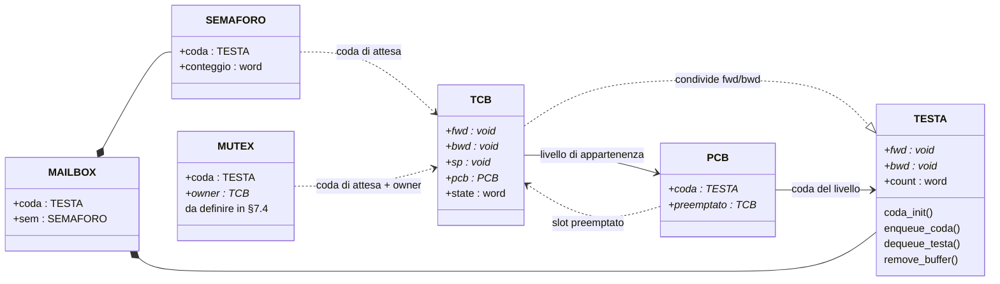
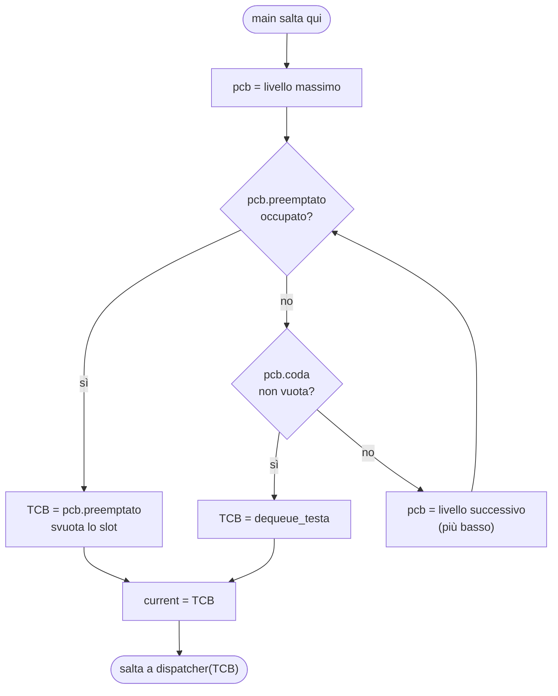
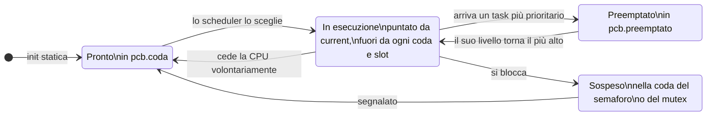
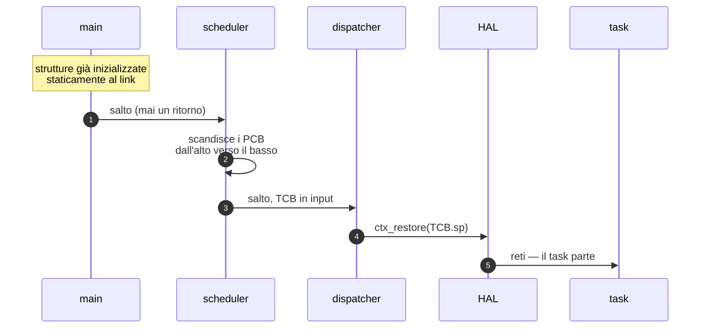
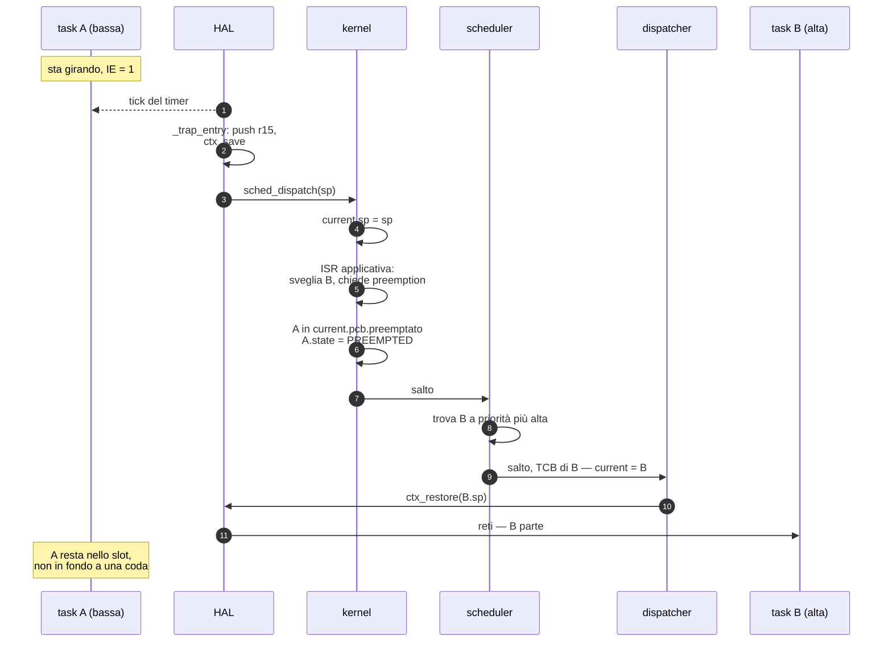

# Proposta: kernel realtime a priorità statiche con PCB

> Discussione del **29 agosto 2026** — modello in definizione, nessuna riga di
> codice ancora scritta.
> Sostituirà il disegno a coda singola di
> [`linked/scheduler/kernel/scheduler.vasm`](../linked/scheduler/kernel/scheduler.vasm).
>
> **Stato: tre decisioni prese (§7.1–7.3), una aperta (§7.4).**

I diagrammi sono in Mermaid: GitHub li rende nativamente; in VS Code serve
un'estensione per l'anteprima (*Markdown Preview Mermaid Support*).

---

## 1. Il modello

- **TCB, code di priorità, PCB, mailbox e semafori sono dichiarati e
  inizializzati staticamente.** Nessuna allocazione, nessun percorso d'errore
  all'avvio, footprint noto al link.
  - **TCB**: il primo contesto di ogni task ha i registri a 0 e gli interrupt
    abilitati.
  - **PCB** (*Priority Control Block*): uno per ogni coda di priorità, con due
    campi — l'indirizzo della coda di quel livello e l'indirizzo dell'eventuale
    TCB preemptato a quel livello.
  - **Mailbox**: una coda (il tipo di `coda.vasm`) più un semaforo.
  - **Semafori**: da specificare.
- **Esiste sempre un task idle**, a priorità minima, che non rilascia mai la
  CPU: viene solo preemptato.
- **Il main salta allo scheduler**, che seleziona il TCB del primo task pronto
  scandendo le priorità.
- **Lo scheduler salta al dispatcher** passandogli in input il TCB da attivare.

### Nota terminologica

Nel seguito **«slot»** è l'abbreviazione per *il campo `preemptato` del PCB*,
cioè il secondo campo dell'elenco qui sopra. Non è un concetto aggiuntivo.

---

## 2. Perché il campo `preemptato` porta il peso di tutto il modello

Con una ready queue sola, un task preemptato torna in fondo alla coda: sta
pagando per un'interruzione che non ha chiesto. Quando il livello riprende la
CPU parte un **altro** task, e quello interrotto ha perso il turno senza aver
fatto nulla.

Lo slot lo tiene da parte, identificato, e glielo restituisce: la preemption
diventa trasparente al preemptato. In più separa tre situazioni che nel disegno
attuale finiscono nello stesso posto:

| Il task… | …finisce | perché |
|---|---|---|
| ha lasciato la CPU **controvoglia** | in `PCB.preemptato` | riprenderà da dove stava |
| **l'ha ceduta lui** | in fondo a `PCB.coda` | ha rinunciato al turno |
| si è **bloccato** | nella coda del semaforo o del mutex | non è più eseguibile |

### Cosa cambia rispetto a oggi

| Disegno attuale | Modello a PCB |
|---|---|
| Una ready queue sola, nessuna priorità | Una coda per livello, scandite dall'alto |
| `scheduler` riaccoda **sempre** l'uscente: il blocking è inesprimibile | Dove va l'uscente lo decide chi lo toglie dalla CPU, non chi sceglie il prossimo |
| La coda non è mai vuota solo perché si accoda prima di estrarre | L'idle a priorità minima garantisce la terminazione della scansione |
| `dispatcher` rilegge `current` dalla memoria | Il TCB arriva al dispatcher come argomento |
| Il primo task parte da un percorso di boot dedicato | Il primo task parte come il millesimo switch |

---

## 3. Le strutture statiche

Le code sono quelle già implementate in
[`kernel/coda.vasm`](../linked/scheduler/kernel/coda.vasm): liste circolari
doppie con sentinella, idioma `list_head` del kernel Linux.



> Il TCB non **eredita** da TESTA: ne condivide i primi otto byte, così lo
> stesso codice di insert/remove vale per la testa e per i nodi.

### Layout dei campi

**TCB** — 20 byte

| Off | Campo | Significato |
|---|---|---|
| +0 | `fwd` | link avanti |
| +4 | `bwd` | link indietro |
| +8 | `sp` | contesto opaco salvato |
| +12 | `pcb` | **indirizzo del PCB** del suo livello (§7.3) |
| +16 | `state` | stato corrente, quattro valori (§7.2) |

**PCB** — 8 byte, uno per livello di priorità

| Off | Campo | Significato |
|---|---|---|
| +0 | `coda` | indirizzo della coda di questo livello |
| +4 | `preemptato` | TCB interrotto a questo livello, 0 se nessuno |

**TESTA** — 12 byte (già esistente, invariata)

| Off | Campo | Significato |
|---|---|---|
| +0 | `fwd` | primo nodo, o sé stessa se vuota |
| +4 | `bwd` | ultimo nodo |
| +8 | `count` | elementi in coda |

### Variabili globali del kernel

| Nome | Significato |
|---|---|
| `current` | indirizzo del TCB in esecuzione (già esistente, sopravvive — §7.1) |

> **Un'indirezione in meno.** Se ogni PCB ha esattamente una coda e sono
> entrambi statici, la `TESTA` può stare **dentro** il PCB invece di essere
> puntata: si risparmia una `lw` per ogni livello scandito, e la scansione è il
> percorso più caldo del kernel. Il puntatore serve solo se un giorno più PCB
> devono condividere la stessa coda. *Da valutare.*

---

## 4. La regola di selezione

Lo scheduler scandisce i livelli dal più alto al più basso. A ogni livello **lo
slot batte la coda**: se c'è un task interrotto qui, tocca a lui riprendere, non
a un suo pari che stava solo aspettando.



**La scansione termina sempre**: l'idle non si blocca mai, quindi il livello
minimo è pronto per costruzione. Non serve il caso "nessun task eseguibile".

**Perché un solo campo `preemptato` basta.** A ogni livello, al massimo un task
può trovarsi a metà esecuzione. Un secondo task dello stesso livello potrebbe
partire solo se il livello venisse selezionato, e la selezione preferisce lo
slot alla coda: finché lo slot è pieno, dalla coda non esce nessuno. È **questa
preferenza** a rendere corretto un campo singolo — invertirla richiederebbe una
pila.

---

## 5. Lo stato di un task e la sua posizione

Lo stato di un task corrisponde a una posizione fisica precisa. Il campo
`state` **non è ridondante** (§7.2): serve per sapere in quale coda un TCB si
trova *adesso*, cosa che il solo `TCB.pcb` non dice.



**Ci possono essere più task `PREEMPTED` contemporaneamente**: A a priorità 5
preemptato da B a 3, preemptato a sua volta da C a 1 — due slot occupati, un
solo `current`. Ne discende un regalo per il debug: **la catena degli slot
occupati, letta dall'alto verso il basso, è la pila delle preemption
annidate**, e la si ottiene scandendo la tabella dei PCB senza tenere traccia di
nulla.

---

## 6. I due percorsi

Il primo avvio e ogni cambio di contesto successivo passano dallo **stesso
codice**: il boot non è un caso particolare, è semplicemente la prima volta che
lo scheduler scandisce i livelli.

### Avvio



Nessuna `call`: sono salti, e nessuno di questi passi ha un ritorno da onorare.
Sparisce la finzione attuale delle tre `call` che non ritornano mai
(`sched_dispatch` → `dispatcher` → `ctx_restore`, più `call sched_dispatch` in
[`hal/machine.vasm:53`](../linked/scheduler/hal/machine.vasm#L53)).

### Preemption



A non perde il turno: quando il suo livello torna il più alto, riprende
esattamente da dove era.

---

## 7. Le decisioni

### 7.1 `current` sopravvive — **DECISA**

Esiste già la variabile che contiene l'indirizzo del TCB in esecuzione, e resta.

Conseguenza sulla semantica dello slot: **si riempie nell'istante della
preemption**, non mentre il task gira. Il task in esecuzione resta com'è oggi —
fuori da ogni coda e da ogni slot, puntato solo da `current`. Il percorso di
trap non cambia struttura: l'HAL consegna l'`sp`, il kernel lo scrive in
`current.sp`.

### 7.2 `state` resta, ma i valori diventano quattro — **DECISA**

Il campo è essenziale per il debugging. **E ha un secondo motivo tecnico**: dato
un TCB, `TCB.pcb->coda` fornisce la sua coda di *ready*, non la coda in cui si
trova **adesso**. Se il task è sospeso sta in quella di un semaforo o di un
mutex, e per sganciarlo con `remove_buffer` (che vuole la testa giusta, vedi
[`coda.vasm:87-95`](../linked/scheduler/kernel/coda.vasm#L87-L95)) bisogna sapere
quale delle due. Senza `state` non lo sai. Non è ridondanza: è l'unico modo di
sapere dove cercare.

Oggi [`types.vinc`](../linked/scheduler/include/types.vinc) ha tre valori. Con lo
slot ne serve un quarto: un task in `PCB.preemptato` non è in una coda di ready,
non è sulla CPU e non è bloccato. Marcarlo `READY` farebbe mentire il campo
proprio nel momento in cui lo si interroga per capire cosa sta succedendo.

```
.equ READY      0    ; in pcb.coda
.equ RUNNING    1    ; puntato da current, fuori da tutto
.equ PREEMPTED  2    ; in pcb.preemptato          <- NUOVO
.equ SUSPENDED  3    ; in una coda di semaforo o mutex
```

### 7.3 `TCB.pcb` contiene l'indirizzo del PCB, non il numero di livello — **DECISA**

Il guadagno è sul percorso di riaccodamento, che è caldo (preemption, yield,
risveglio da semaforo): con un indice servirebbe `slli` + `add` sulla base della
tabella e poi la `lw` per arrivare alla coda; col puntatore è una `lw` sola. È lo
stesso idioma della lista intrusiva — si memorizza il puntatore che si
dereferenzierà, non un indice da convertire.

> ### ⚠ Invariante portante: la tabella dei PCB va disposta in ordine di priorità
>
> Le decisioni di scheduling non usano la priorità solo per raggiungere una
> coda: la **confrontano**. Quando un semaforo viene segnalato da un'ISR bisogna
> sapere se il task risvegliato è più prioritario di quello in esecuzione, per
> decidere se chiedere la preemption.
>
> Con un puntatore il confronto non è possibile — **a meno che la tabella dei
> PCB non sia disposta in memoria in ordine di priorità**. Se lo è, l'indirizzo
> è monotòno nella priorità e una `blt` sui puntatori *è* il confronto, senza
> conversioni.
>
> Essendo tutto statico quella disposizione ci sarà comunque, ma va scritta come
> invariante esplicita: lega la correttezza dei confronti all'**ordine di
> dichiarazione** nella sezione dati. Chi un domani inserisce un livello in mezzo
> o riordina le direttive rompe i confronti **senza che nulla segnali l'errore**.
> È il tipo di difetto che si manifesta come inversione di priorità sporadica sei
> mesi dopo.

Effetto collaterale gradito: se si adotta l'ereditarietà, cambiare priorità a un
task diventa **ripuntarlo a un altro PCB**. La priorità nominale sarebbe un
secondo campo dello stesso tipo — due puntatori simmetrici, nessuna aritmetica.

Il nome `prio` sarebbe fuorviante per un campo che contiene un indirizzo: si
chiama `pcb`.

### 7.4 Inversione di priorità: ereditarietà o ceiling? — **APERTA, da decidere**

**È la questione da riprendere.** Priorità statiche più mutex, senza
contromisure, danno inversione illimitata: un task ad alta priorità resta dietro
a uno basso per un tempo non calcolabile.

Il campo `prio_eff` riguarda i **mutex, non i semafori**. L'ereditarietà ha senso
solo dove c'è un *proprietario* da promuovere: un semaforo contatore non ce l'ha
— chi si blocca aspetta un evento, non un task, e non c'è nessuno da spingere in
alto. Ne segue che **mutex e semaforo non sono lo stesso tipo con parametri
diversi**: il mutex ha in più il TCB del possessore, ed è quel campo a rendere
possibile l'ereditarietà. Molti kernel piccoli li fondono e poi se ne pentono.

Il punto delicato non è promuovere, è **tornare indietro**. Se un task possiede
due mutex ed è stato promosso da due bloccati diversi, al rilascio del primo non
deve tornare alla priorità nominale: deve restare alto per l'altro. Il ripristino
ingenuo "rilascio → torno nominale" è corretto solo con un mutex alla volta.

Le due strade cambiano **cosa va dichiarato staticamente**:

| | Ereditarietà vera | Priority ceiling (ICPP) |
|---|---|---|
| **Come funziona** | al rilascio si ricalcola la priorità effettiva come massimo fra la nominale e il bloccato più prioritario di ogni mutex ancora posseduto | ogni mutex ha un *ceiling* statico; chi lo acquisisce viene promosso subito a quel livello, indipendentemente da chi si bloccherà poi |
| **Costo nel TCB** | una `TESTA` per la lista dei mutex posseduti: +12 byte, più il link nel mutex | nulla |
| **Costo nel mutex** | link di lista | un campo con la priorità precedente all'acquisizione |
| **Costo a runtime** | ricalcolo a ogni rilascio | O(1) |
| **Rischio** | complessità | il ceiling va dichiarato correttamente a mano: se un task più prioritario del ceiling prende il mutex, la garanzia salta **in silenzio** |

**Raccomandazione: il ceiling.** Discende da come è impostato tutto il resto — se
task, mutex e priorità sono dichiarati staticamente, si sa già quali task possono
toccare quale mutex, quindi **il ceiling è una costante calcolabile a
compile-time**, non una cosa da scoprire a runtime. È esattamente il tipo di
analisi che l'allocazione statica regala. In più il ceiling dà un limite
superiore calcolabile al blocking time, che è ciò che serve se il sistema deve
essere analizzabile davvero.

Con acquisizioni e rilasci **annidati per costruzione**, salvare nel mutex la
priorità precedente basta: non serve nessuna lista.

---

## 8. Ricaduta sulle mailbox

[`coda.vasm`](../linked/scheduler/kernel/coda.vasm) è **intrusiva**: il link sta
a offset 0 e i dati partono da +8. Qualunque cosa una mailbox trasporti deve
quindi cominciare con `fwd`/`bwd`.

Se sono messaggi, serve un **pool statico di buffer** con la sua free list — che
può essere una `coda` pure quella. La dimensione del pool diventa una costante di
compile-time come tutto il resto.

---

## 9. Cosa sopravvive del codice attuale

| Componente | Destino |
|---|---|
| [`hal/machine.vasm`](../linked/scheduler/hal/machine.vasm) | **intatto** — il confine HAL/kernel sul contesto opaco regge |
| [`kernel/coda.vasm`](../linked/scheduler/kernel/coda.vasm) | **intatto** — è il tipo coda usato da PCB, semafori, mutex e mailbox |
| `current` | **sopravvive** (§7.1) |
| `ctx_init` | probabilmente **eliminabile**: con l'init statica il frame iniziale è un'area di `.data` già giusta, non va costruita a runtime |
| `kernel/scheduler.vasm` | **riscritto**: politica, meccanismo e transizioni di stato oggi stanno tutti dentro `scheduler` |
| `TCB.state` | **resta**, con un quarto valore `PREEMPTED` (§7.2) |
| `ready` (coda singola) | **sostituita** dalla tabella dei PCB |
